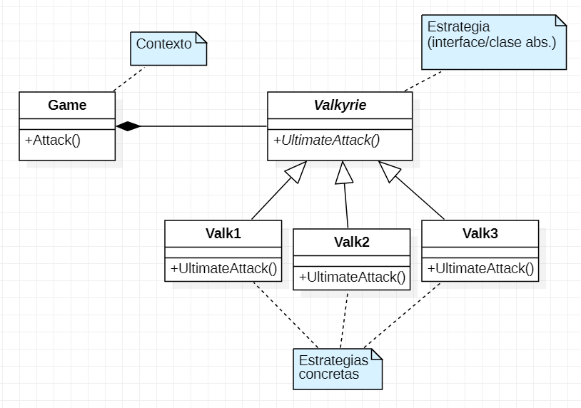

# Honkai Simulation:
## Información:
> Ejemplo básico (tipo juego) que consiste en simular una batalla de Honkai Impact 3rd, empleando el patrón **Strategy** para el intercambio de valquirias.

## Sobre el Patrón Strategy:
> Es un patrón de _comportamiento_, sirve para encapsular lógica y delegar funcionalidades que pueden ir cambiando a lo largo de la ejecución del programa. Su objetivo es poder tener diferentes algoritmos encapsulados para así evitar usar sentencias if/else o repetir código.
> 
> Su funcionamiento consiste básicamente en crear objetos que representan estrategias y cada una de estas heredan de una interfaz o clase abstracta, por lo que son utilizables de forma polimórfica.
> 
> Consta principalmente de 2 elementos:
> - **Estrategia:** Es una interface/clase abstracta donde se declaran todos los algoritmos que serán implementados de forma polimórfica en las respectivas clases de las estrategias.
> 
> - **Estrategia concreta:** Implementa los algoritmos declarados en la Estrategia, en este caso son las clases de cada una de las valquirias.
> 
> - **El contexto:** la clase (o función) que utiliza las estrategias.

## Diagrama de clases:

